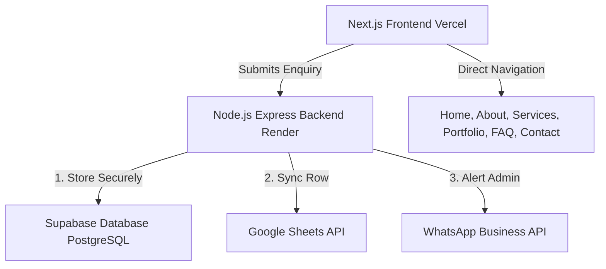

# DRST Technologies — Final Production Website Implementation Plan

This implementation plan outlines the development of the **DRST Technologies** official website, ensuring a premium, high-converting, and modern digital presence with robust automation features (Supabase tracking, Google Sheets sync, and WhatsApp notifications).

## User Review Required

> [!IMPORTANT]
> The logo file [DRST Technologies logo.png](file:///c:/Users/HP/OneDrive/Documents/DRST%20Technologies/DRST%20Technologies%20logo.png) will be moved/copied to the frontend assets folder and used directly without redesign or alteration, adhering strictly to the branding guidelines.

> [!IMPORTANT]
> **API Integration Settings & Configuration:**
> - **Google Sheets Automation:** Requires Google Service Account credentials. The service account needs Editor access to a single designated Spreadsheet. We will implement server-side code in our Node.js backend using the official `googleapis` package.
> - **WhatsApp Notification:** Requires WhatsApp Business API credentials (e.g. Cloud API token, Phone Number ID, Template Name). A fallback error handling mechanism is built in to ensure no lead is lost if the API request fails.
> - **Supabase Database:** We will create an `enquiries` table with the requested columns and enable Row Level Security (RLS) to restrict frontend direct write access or route submissions safely through the backend API.

## Open Questions
- *Would you prefer to configure Google Sheets and WhatsApp API immediately, or should we set up clear, fully working mock integrations with environment-variable feature flags (e.g. `ENABLE_SHEETS=true/false`, `ENABLE_WHATSAPP=true/false`) so you can test the site end-to-end first before inserting your live production API tokens?*
- *For the optional success sound on submission, do you have a preferred audio file, or shall we include a clean, muted web-audio-synthesized chime or lightweight default sound?*

---

## Technical Stack & Architecture



### Folder Structure

We will organize the workspace into two clean subdirectories:
1. `frontend/` - Next.js (App Router, Tailwind CSS, TS, Lucide React, Framer Motion).
2. `backend/` - Node.js Express Server (TypeScript, Supabase client, Google APIs, Axios for WhatsApp, CORS, Express Rate Limit).

```
c:\Users\HP\OneDrive\Documents\DRST Technologies\
├── frontend/             # Next.js App
│   ├── public/           # Static assets (including optimized Logo)
│   ├── src/
│   │   ├── app/          # App Router Pages
│   │   ├── components/   # UI & Layout components
│   │   ├── styles/       # Global styles (Tailwind configuration)
│   │   └── utils/        # API utilities
├── backend/              # Node.js API
│   ├── src/
│   │   ├── controllers/  # Route handlers (Enquiry processing, retries)
│   │   ├── services/     # Sheets, Supabase, WhatsApp integrations
│   │   ├── middleware/   # Rate limiting, validation
│   │   └── app.ts        # Express setup
├── supabase/             # SQL setup script and schema configurations
└── .env.example          # Template for required secrets
```

---

## Database Design & Google Sheets Structure

### Supabase Table: `enquiries`

We will create a table named `enquiries` with the following schema:

| Column Name | PostgreSQL Type | Nullable | Default | Description |
| :--- | :--- | :--- | :--- | :--- |
| `id` | `UUID` | No | `uuid_generate_v4()` | Unique enquiry ID |
| `date` | `TIMESTAMPTZ` | No | `now()` | Date and time of enquiry |
| `client_name` | `TEXT` | No | | Client's full name |
| `company_name` | `TEXT` | Yes | | Client's company/business name |
| `phone_number` | `TEXT` | No | | Client's phone number |
| `email` | `TEXT` | No | | Client's email address |
| `service` | `TEXT` | No | | Requested service (Website Dev, AI Automation, Logo) |
| `budget` | `TEXT` | Yes | | Project budget |
| `requirements` | `TEXT` | No | | Project requirements details |
| `additional_info`| `TEXT` | Yes | | Additional information |
| `enquiry_status` | `TEXT` | No | `'New'` | New, Contacted, Discussing, Quotation Sent, Confirmed, Not Proceeding |
| `whatsapp_status`| `TEXT` | No | `'Pending'` | Status of WhatsApp message delivery (Sent, Failed, Pending) |
| `sheets_status` | `TEXT` | No | `'Pending'` | Status of Google Sheets synchronization (Synced, Failed, Pending) |
| `project_status` | `TEXT` | No | `'Not Started'`| Not Started, Planning, Design, Development, Testing, Delivered, Completed |
| `website_delivered`| `BOOLEAN`| No | `false` | True if the website has been delivered |
| `free_update_used` | `TEXT` | No | `'Not Used'` | Not Used, Used |
| `payment_status` | `TEXT` | No | `'Pending'` | Pending, Advance Paid, Partially Paid, Fully Paid |
| `total_amount` | `NUMERIC` | Yes | `0` | Total project commercial agreement |
| `advance_paid` | `NUMERIC` | Yes | `0` | Advance payment amount |
| `balance_amount` | `NUMERIC` | Yes | `0` | Calculated balance amount |
| `maintenance_required` | `TEXT`| No | `'Not Required'`| Not Required, Requested, In Progress, Completed |
| `maintenance_charges` | `NUMERIC`| Yes | `0` | Maintenance charges for paid work |
| `notes` | `TEXT` | Yes | | Internal business notes |
| `updated_at` | `TIMESTAMPTZ` | No | `now()` | Time of last status update |

### Google Sheets Mapping

When an enquiry is written, a row is automatically appended to the Sheet matching the columns of the `enquiries` table in order. The backend will map SQL data directly to Google Sheets API parameters.

---

## Brand Identity & Design System

We will implement the official brand colors in the Tailwind CSS configuration:
- **Obsidian Black** (`#0B0B0F`): Main application backgrounds.
- **Champagne Gold** (`#D4AF6A`): Accents, primary titles, CTAs, logo styling.
- **Warm Ivory** (`#F5F1E8`): Primary text, readable light backgrounds.
- **Graphite** (`#24242B`): Cards, borders, inputs, inner headers.
- **Muted Gold** (`#A8894F`): Hover states, details, secondary accents.

**Typography**: Inter (Google Fonts) with Outfit (for headers), providing a premium digital look.
**Logo**: Placed in the header, footer, and loading sequences exactly as provided.

---

## Proposed Changes

### Component 1: Database Setup

#### [NEW] [schema.sql](file:///c:/Users/HP/OneDrive/Documents/DRST%20Technologies/supabase/schema.sql)
- Contains SQL commands to create the `enquiries` table, setup triggers for `updated_at`, configure Row Level Security (RLS) policies, and create helper functions.

---

### Component 2: Backend (Render)

#### [NEW] [package.json](file:///c:/Users/HP/OneDrive/Documents/DRST%20Technologies/backend/package.json)
- Configures Node.js, TypeScript, nodemon, and dependencies (`express`, `dotenv`, `@supabase/supabase-js`, `googleapis`, `axios`, `cors`, `helmet`, `express-rate-limit`, `joi`).

#### [NEW] [tsconfig.json](file:///c:/Users/HP/OneDrive/Documents/DRST%20Technologies/backend/tsconfig.json)
- Configures TypeScript options for compiler.

#### [NEW] [app.ts](file:///c:/Users/HP/OneDrive/Documents/DRST%20Technologies/backend/src/app.ts)
- Initializes Express server with secure middlewares (`helmet`, `cors` with restricted origins, `express.json()`).
- Implements rate limiting on the `/api/enquiry` submission route to prevent spam.

#### [NEW] [enquiry.controller.ts](file:///c:/Users/HP/OneDrive/Documents/DRST%20Technologies/backend/src/controllers/enquiry.controller.ts)
- Validates the incoming payload server-side using Joi.
- Saves the record to Supabase.
- Initiates Google Sheets synchronization and WhatsApp alerts using service handlers.
- Implements robust try-catch blocks to prevent third-party API downtime from failing the response.

#### [NEW] [supabase.service.ts](file:///c:/Users/HP/OneDrive/Documents/DRST%20Technologies/backend/src/services/supabase.service.ts)
- Interacts with Supabase database client to insert, update, and fetch records.

#### [NEW] [sheets.service.ts](file:///c:/Users/HP/OneDrive/Documents/DRST%20Technologies/backend/src/services/sheets.service.ts)
- Connects to Google Sheets using Google OAuth2 / Service Account JWT.
- Appends submissions to the main Google Sheet.
- Automatically handles status updates in Supabase if the integration fails or succeeds.

#### [NEW] [whatsapp.service.ts](file:///c:/Users/HP/OneDrive/Documents/DRST%20Technologies/backend/src/services/whatsapp.service.ts)
- Sends template messages or custom messages using WhatsApp Business API to `8870620760`.
- Handles connection timeouts and maps success/failure to Supabase status.

---

### Component 3: Frontend (Vercel)

#### [NEW] [package.json](file:///c:/Users/HP/OneDrive/Documents/DRST%20Technologies/frontend/package.json)
- Configures Next.js, React, Tailwind, Framer Motion, and Lucide React.

#### [NEW] [tailwind.config.ts](file:///c:/Users/HP/OneDrive/Documents/DRST%20Technologies/frontend/tailwind.config.ts)
- Configures the custom design theme using only the official brand colors.

#### [NEW] [layout.tsx](file:///c:/Users/HP/OneDrive/Documents/DRST%20Technologies/frontend/src/app/layout.tsx)
- Sets up standard metadata, fonts, responsive wrapper, and floating WhatsApp widget.

#### [NEW] [page.tsx](file:///c:/Users/HP/OneDrive/Documents/DRST%20Technologies/frontend/src/app/page.tsx)
- Premium, high-converting homepage featuring:
  - Hero Section (DRST Technologies - Digital Solutions. Real Transformation)
  - About Summary (Web, AI Automation, Brand Identity)
  - Features overview

#### [NEW] [about/page.tsx](file:///c:/Users/HP/OneDrive/Documents/DRST%20Technologies/frontend/src/app/about/page.tsx)
- Professional details about DRST, services structure, and commitment to quality.

#### [NEW] [services/page.tsx](file:///c:/Users/HP/OneDrive/Documents/DRST%20Technologies/frontend/src/app/services/page.tsx)
- Contains detailed pricing structure:
  - Website Development (Basic ₹7,999, Business ₹14,999, Premium ₹29,999)
  - AI Automation (Starting ₹4,999)
  - Logo & Brand Identity details
  - Free update policy ("One minor update is included after website delivery. Additional updates are charged separately based on the scope of work.")
  - Clear message: "Final pricing depends on requirements, design, integrations, and overall scope."

#### [NEW] [portfolio/page.tsx](file:///c:/Users/HP/OneDrive/Documents/DRST%20Technologies/frontend/src/app/portfolio/page.tsx)
- Showcases the real client project:
  - **Project Name:** Student Leave Management System
  - **Client:** J.N.N. Institute of Engineering
  - **Category:** Web Application
  - **Live URL:** https://student-leave-management-umber.vercel.app
  - **Details:** Full leave approval flow for student/faculty/HOD, database records management, PDF output generation.

#### [NEW] [faq/page.tsx](file:///c:/Users/HP/OneDrive/Documents/DRST%20Technologies/frontend/src/app/faq/page.tsx)
- Dynamic and clean Accordion displaying answers on services, process, timelines, custom build, AI automation, SEO, support, and pricing.

#### [NEW] [contact/page.tsx](file:///c:/Users/HP/OneDrive/Documents/DRST%20Technologies/frontend/src/app/contact/page.tsx)
- Premium Contact details (Phone, Email, placeholder social links) and Google Maps placeholder.

#### [NEW] [start-project/page.tsx](file:///c:/Users/HP/OneDrive/Documents/DRST%20Technologies/frontend/src/app/start-project/page.tsx)
- Beautiful multiphase or clean single-view Project Enquiry Form.
- Fields validated client-side, showing neat loading indicator, custom success animation, and redirects.

#### [NEW] [thank-you/page.tsx](file:///c:/Users/HP/OneDrive/Documents/DRST%20Technologies/frontend/src/app/thank-you/page.tsx)
- Post-submission dashboard page showing success validation status and next-steps.

#### [NEW] [not-found.tsx](file:///c:/Users/HP/OneDrive/Documents/DRST%20Technologies/frontend/src/app/not-found.tsx)
- Custom premium 404 page in obsidian black and champagne gold.

#### [NEW] [privacy-policy/page.tsx](file:///c:/Users/HP/OneDrive/Documents/DRST%20Technologies/frontend/src/app/privacy-policy/page.tsx)
- Privacy details for form data collection.

#### [NEW] [terms/page.tsx](file:///c:/Users/HP/OneDrive/Documents/DRST%20Technologies/frontend/src/app/terms/page.tsx)
- Terms of service, commercial agreements, update and maintenance definitions.

#### [NEW] [refund-policy/page.tsx](file:///c:/Users/HP/OneDrive/Documents/DRST%20Technologies/frontend/src/app/refund-policy/page.tsx)
- Refund rules highlighting non-refundable parameters on custom finished work.

---

## Verification Plan

### Automated Tests
- Server integration test suite run locally to assert correct Joi validation and Supabase DB calls.
- Run `npm run build` in both frontend and backend directories to check for TypeScript type check or compile errors.

### Manual Verification
- **Form Submission Cycle:** Submit multiple enquiries through the form and check database rows, Google Sheet cell alignments, and check log reports for simulated WhatsApp alerts.
- **Fail-safe Check:** Disable Sheets/WhatsApp and verify the enquiry is saved to Supabase with status values correctly marked as 'Failed' (with error message in backend logs).
- **Responsive Audit:** Inspect views using browser developer tools on iPhone, iPad, and desktop viewport sizes.
- **Color Audit:** Verify that no color hexes other than `#0B0B0F`, `#D4AF6A`, `#F5F1E8`, `#24242B`, and `#A8894F` are used.
